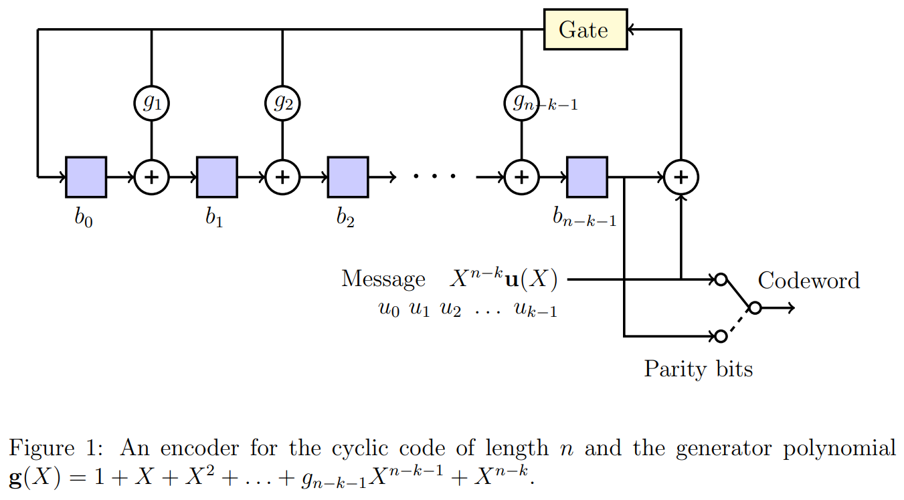

## Theory

The theory associated with Experiment-8 is divided into two parts:

(1) Basics of cyclic codes  
(2) Shift register based encoder and decoder

## 1 &nbsp; &nbsp; Basics of cyclic codes

Cyclic codes form an important subclass of linear block codes. In this section, we will introduce definition and basic properties of cyclic codes.   A detailed discussion of the topics covered in these notes can be found in [1, Chapter 5]. In this Experiment, we will focus on _binary_ cyclic codes. In Experiment-7, we had introduced Reed-Solomon codes. Note that Reed-Solomon codes form a class of _non-binary_ cyclic codes.   In Experiment-3, we studied Hamming codes, which are binary cyclic codes.   

Let us first define the operation of cyclic shift of a vector. Consider a vector $\mathbf{v} = [v_0,   v_1, v_{n-1}]$. 
Then the vector $\mathbf{v}^{(i)}$ obtained by shifting $\mathbf{v}$ cyclically to the right $i$-times is given by  
&nbsp; &nbsp; &nbsp; &nbsp; &nbsp; &nbsp; &nbsp; &nbsp; &nbsp; &nbsp;  &nbsp; &nbsp; &nbsp;  $\mathbf{v}^{(i)} = [v_{n-i}  v_{n-i+1}  . . .  v_0   v_1  . . .  v_{n-i-1}]$. &ensp; &ensp;  &ensp; &ensp; (1)  
For a cyclic code, as the name suggests,  cyclic shift of any codeword is also a codeword. This property precisely defines a cyclic code. 
 
 **Definition&ensp;1** &ensp; _A linear block code_ $C(n,k)$ _is said to be a cyclic code if every cyclic shift of a codeword is also a codeword in the given code_ $C(n,k)$.  
Before providing other properties of cyclic codes, let us consider a simple example for a cyclic code. Consider a linear block code of length $n=4$ and dimension $k=2$ 
with the set of codewords given by $\{ [0000, 1010, 0101, 1111] \}$. Observe that any cyclic shift of a codeword is again a valid codeword and hence this linear block code is a cyclic code. Students are encouraged to revisit Experiment-3 and verify that Hamming codes indeed follow this property and are cyclic codes.

For cyclic codes, it is convenient to represent its codewords using polynomials. The polynomial representation of vector $\mathbf{v} = [v_0  v_1  v_{n-1} ]$, denoted by $\mathbf{v}(X)$, is given by    
&ensp;&ensp;&ensp;&ensp;&ensp;&ensp;&ensp;&ensp;&ensp;&ensp;&ensp;&ensp;&ensp; $\mathbf{v}(X) = [ v_0 + v_1X + v_2X^2 + ... + v_{n-1}X^{n-1}]$. &ensp;&ensp;&ensp;&ensp; (2)

Let $\mathbb{F}_2[X]$ denotes the set of polynomials with the coefficients chosen from $\mathbb{F}_2$. Thus the polynomial $\mathbf{v}(X)$ in $\mathbb{F}_2[X]$.
For the given cyclic code $\mathcal{C}(n,k)$, there exists a polynomial $g(X)$ in $\mathbb{F}_2[X]$ such that any codeword $\mathbf{v}(X)$ in $\mathcal{C}(n,k)$ can be written as  
&ensp;&ensp;&ensp;&ensp;&ensp;&ensp;&ensp;&ensp;&ensp;&ensp;&ensp;&ensp;&ensp; $\mathbf{v}(X)$ = $\mathbf{u}(X)g(X)$, &ensp;&ensp;&ensp;&ensp;&ensp;&ensp;&ensp;&ensp;&ensp;&ensp;&ensp;&ensp;&ensp;&ensp;&ensp;&ensp;&ensp;&ensp;&ensp;&ensp;&ensp;&ensp;&ensp;&ensp;&ensp;&ensp;(3)

where $\mathbf{u}(X)$ is the polynomial corresponding to the message $\mathbf{u} \in \mathbb{F}_2^k$. For multiplying two polynomials in $\mathbb{F}_2[X]$, the individual additions and multiplications of the corresponding coefficients should be performed over $\mathbb{F}_2$ (details can be found in the theory of Experiment-1, Part-1).
  See Eq.(5) discussed below for an illustration of multiplication of two polynomials in $\mathbb{F}_2[X]$. Observe that the maximum degree of a codeword polynomial will be $n-1$ and similarly the maximum degree of a message polynomial can be $k-1$.

The polynomial $g(X)$ defined in Eq.(3) is called as the _generating polynomial_ of the code and the corresponding cyclic code is said to be generated by its generating polynomial $g(X)$. 
We now summarize some of the properties of the generating polynomial. Details can be found in [1, Section 5.1]. The proofs of these properties are out of scope for our current experiment, however students are encouraged to verify these properties for Examples-1 and 2 given below.

 1. For the given cyclic code $\mathcal{C}(n,k)$, the generating polynomial $g(X)$ is the non-zero codeword of the minimum degree.  
 2. The generating polynomial of a cyclic code is unique.
 3. Degree of the generating polynomial is equal to $n-k$.
 4. Suppose $g(X)$ = $g_0 + g_1X + ... + g_{n-k}X^{n-k}$. Then we have $g_0 = g_{n-k} = 1$.
 5. A generator matrix $G \in \mathbb{F}_2^{k \times n}$ of the code $\mathcal{C}(n,k)$ can be written directly using its generating polynomial $g(X) = g_0 + g_1X + \ldots + g_{n-k}X^{n-k}$ as follows,
 
 6. The generating polynomial $g(X)$ is a factor of the polynomial $X^n+1$.
  
 Let us consider some examples of cyclic codes. 
 
1. **Example-1:** Consider the cyclic code of length $n=4$ and dimension $k=2$  with the set of codewords given by $\{ 0000, 1010, 0101, 1111 \}$. Suppose $\mathbf{v}_1 = 0000$, $\mathbf{v}_2 = 1010$, $\mathbf{v}_3 = 0101$, $\mathbf{v}_4 = 1111$. 
The polynomial representations of these codewords are given below
 

 
Observe that every codeword is a multiple of the polynomial $\tcr{1+X^2}$ and hence it is the generating polynomial of the code. Using property-5, can you write down a generating matrix of this code?

