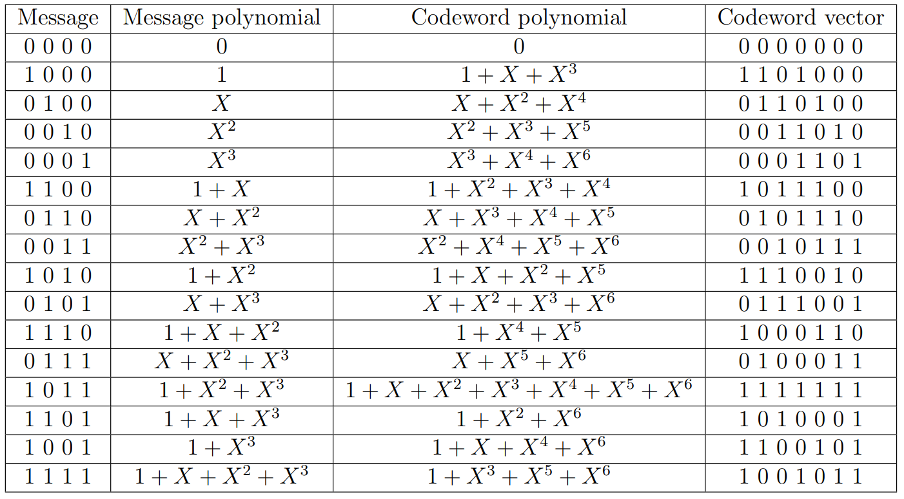

## Theory

The theory associated with Experiment-8 is divided into two parts:

(1) Basics of cyclic codes  
(2) Shift register based encoder and decoder

## 1 &nbsp; &nbsp; Basics of cyclic codes

Cyclic codes form an important subclass of linear block codes. In this section, we will introduce definition and basic properties of cyclic codes.   A detailed discussion of the topics covered in these notes can be found in [1, Chapter 5]. In this Experiment, we will focus on _binary_ cyclic codes. In Experiment-7, we had introduced Reed-Solomon codes. Note that Reed-Solomon codes form a class of _non-binary_ cyclic codes.   In Experiment-3, we studied Hamming codes, which are binary cyclic codes.   

Let us first define the operation of cyclic shift of a vector. Consider a vector $\mathbf{v} = \begin{bmatrix} v_0 & v_1 & v_{n-1}\end{bmatrix}$ .
Then the vector $\mathbf{v}^{(i)}$ obtained by shifting $\mathbf{v}$ cyclically to the right $i$-times is given by  
$$
\begin{equation}
 \mathbf{v}^{(i)} = \begin{bmatrix} v_{n-i} & v_{n-i+1} & . . .  &v_0 & v_1 & . . . &v_{n-i-1}\end{bmatrix} 
\end{equation}
$$.  
For a cyclic code, as the name suggests,  cyclic shift of any codeword is also a codeword. This property precisely defines a cyclic code. 
 
 $\textbf{Definition 1 :}$ &ensp; _A linear block code_ $C(n,k)$ _is said to be a cyclic code if every cyclic shift of a codeword is also a codeword in the given code_ $C(n,k)$.   
Before providing other properties of cyclic codes, let us consider a simple example for a cyclic code. Consider a linear block code of length $n=4$ and dimension $k=2$ 
with the set of codewords given by $\{ 0000, 1010, 0101, 1111 \}$. Observe that any cyclic shift of a codeword is again a valid codeword and hence this linear block code is a cyclic code. Students are encouraged to revisit Experiment-3 and verify that Hamming codes indeed follow this property and are cyclic codes.

For cyclic codes, it is convenient to represent its codewords using polynomials. The polynomial representation of vector  $\mathbf{v} = \begin{bmatrix} v_0 & v_1 & v_{n-1}\end{bmatrix}$, denoted by $\mathbf{v}(X)$, is given by    
$$
\begin{equation}
\mathbf{v}(X) = [ v_0 + v_1X + v_2X^2 + ... + v_{n-1}X^{n-1}] 
\end{equation}
$$
Let $\mathbb{F}_2[X]$ denotes the set of polynomials with the coefficients chosen from $\mathbb{F}_2$. Thus the polynomial $\mathbf{v}(X)$ in $\mathbb{F}_2[X]$.
For the given cyclic code $\mathcal{C}(n,k)$, there exists a polynomial $g(X)$ in $\mathbb{F}_2[X]$ such that any codeword $\mathbf{v}(X)$ in $\mathcal{C}(n,k)$ can be written as  
$$
\begin{equation}
 \mathbf{v}(X)=\mathbf{u}(X)g(X)
\end{equation}
$$

where $\mathbf{u}(X)$ is the polynomial corresponding to the message $\mathbf{u} \in \mathbb{F}_2^k$. For multiplying two polynomials in $\mathbb{F}_2[X]$, the individual additions and multiplications of the corresponding coefficients should be performed over $\mathbb{F}_2$ (details can be found in the theory of Experiment-1, Part-1). See Eq.(5) discussed below for an illustration of multiplication of two polynomials in $\mathbb{F}_2[X]$. Observe that the maximum degree of a codeword polynomial will be $n-1$ and similarly the maximum degree of a message polynomial can be $k-1$.

The polynomial $g(X)$ defined in Eq.(3) is called as the _generating polynomial_ of the code and the corresponding cyclic code is said to be generated by its generating polynomial $g(X)$. 
We now summarize some of the properties of the generating polynomial. Details can be found in [1, Section 5.1]. The proofs of these properties are out of scope for our current experiment, however students are encouraged to verify these properties for Examples-1 and 2 given below.

 1. For the given cyclic code $\mathcal{C}(n,k)$, the generating polynomial $g(X)$ is the non-zero codeword of the minimum degree.  
 2. The generating polynomial of a cyclic code is unique.
 3. Degree of the generating polynomial is equal to $n-k$.
 4. Suppose $g(X)$ $=$ $g_0 + g_1X + ... + g_{n-k}X^{n-k}$. Then we have $g_0 = g_{n-k} = 1$.
 5. A generator matrix $G \in \mathbb{F}_2^{k \times n}$ of the code $\mathcal{C}(n,k)$ can be written directly using its generating polynomial $g(X) = g_0 + g_1X + ... + g_{n-k}X^{n-k}$ as follows,
  
$$
\begin{equation}
G = 
\begin{bmatrix}
      g_0    & g_1   & \cdot  & \cdot   & g_{n-k} & 0 & \cdot & 0 \\
      0      & g_0   & \cdot  & \cdot   & \cdot   & g_{n-k}   & \cdot & 0 \\
      \vdots &  &  \ddots  &  &         &         & \vdots    &   \\
      0      & \cdot & 0      & g_0     & \cdot   & \cdot     & \cdot & g_{n-k}
\end{bmatrix}.
\end{equation}
$$
  
 6. The generating polynomial $g(X)$ is a factor of the polynomial $X^n+1$.
  
 Let us consider some examples of cyclic codes. 
 
 

1\. $\textbf{Example-1:}$ Consider the cyclic code of length $n=4$ and dimension $k=2$  with the set of codewords given by $\{ 0000, 1010, 0101, 1111 \}$. Suppose 
$\mathbf{v}_1 = 0000$, $\mathbf{v}_2 = 1010$, $\mathbf{v}_3 = 0101$, $\mathbf{v}_4 = 1111$. 

  The polynomial representations of these codewords are given below
$$
\begin{align*}  
\mathbf{v}_1(X) &= 0 = 0 \times {\color{red}(1 + X^2)} \\
\mathbf{v}_2(X) &= 1 + X^2 = 1 \times {\color{red}(1 + X^2)} \\
\mathbf{v}_3(X) &= X + X^3 = X \times {\color{red}(1 + X^2)} \\
\mathbf{v}_4(X) &= 1 + X + X^2 + X^3 = (1+X) \times {\color{red}(1 + X^2)}.% 
\end{align*}
$$
 Observe that every codeword is a multiple of the polynomial ${\color{red}(1 + X^2)}$ and hence it is the generating polynomial of the code. Using property-5, can you write down a generating matrix of this code?

2\. $\textbf{Example-2}$: Consider a cyclic code of length $n=7$ generated by the generator polynomial $\mathbf{g}(X) = 1 +X +X^3$. Note that this is Hamming code of length $7$ studied in Experiment-3. 
A codeword $\mathbf{v}(X)$ in this code can be obtained by multiplying the message polynomial $\mathbf{u}(X)$ with the generator polynomial $\mathbf{g}(X)$, i.e., $\mathbf{v}(X) = \mathbf{u}(X) \mathbf{g}(X)$. For example, the codeword corresponding to the message polynomial $1+X$ is given by
$$ 
\begin{equation}
%
\begin{aligned}
\mathbf{v}(X) &= \mathbf{u}(X) \mathbf{g}(X)\\
&= (1+X)\times (1+X+X^3)\\
&= 1+X+X^3+X+X^2+X^4\\
&= 1+X^2+X^3+X^4.
\end{aligned}
\end{equation}
$$
It can be seen from Eq.(5) that the codeword corresponding to message vector $\begin{bmatrix} 1 & 1 & 0 & 0\end{bmatrix}$ will be $\begin{bmatrix} 1 & 0 & 1 & 1 & 1 & 0 & 0\end{bmatrix}$. 
All possible codewords of this code can be obtained by considering the message polynomials corresponding to all possible vectors in $\mathbb{F}_2^k$. These are tabulated below. Students are encouraged to verify the calculations towards this by themselves.
 

## 2 &nbsp; &nbsp; Shift register based encoder and decoder
For encoding a message $\mathbf{u} \in \mathbb{F}_2^k$ using a cyclic code, one can consider a generator matrix $G$ of the given code and obtain the corresponding codeword as $\mathbf{v} = \mathbf{u}G$, since cyclic code is a linear block code. However, cyclic codes have rich algebraic structures and this allows to perform encoding operation much efficiently. Similarly, while one can perform decoding of cyclic codes via standard array and syndrome decoding (see Experiment-4), owing to these structural properties, decoding can be performed efficiently. In this experiment, we shall focus on shift register based encoder and decoder for cyclic codes. 

## 2.1 &nbsp; &nbsp; Shift register based encoder

Let us first study shift register based encoder for a cyclic code of length $n$ and the generator polynomial $g(X) = 1+X+X^2+\ldots+g_{n-k-1}X^{n-k-1}+X^{n-k}$ (recall that $g_0=g_{n-k}=1$). Suppose we wish to encode the message polynomial $\mathbf{u}(X) = u_0+u_1X+u_2X^2+ ... +u_{k-1}X^{k-1}$. Let $\mathbf{b}(X)$ be the remainder obtained when the polynomial $X^{n-k}\mathbf{u}(X)$ is divided by $g(X)$. Then it can be shown that (for proof refer [1, Section 5.1]) the corresponding codeword $\mathbf{v}(X)$ will be given by 
 

$$
\begin{equation}
\mathbf{v}(X) = \mathbf{b}(X) + X^{n-k}\mathbf{u}(X).
\end{equation}
$$ 

We shall next see how Eq.(6) can be implemented using shift registers. The encoding circuit corresponding to this is shown in Figure~1. When the value of $g_i=1$, the corresponding connection will present, for $i = 2, 3, \ldots, n-k-1$. Similarly when $g_i=0$, the corresponding connection will not be there. Observe that there are $n-k$ shift registers. The contents of the shift registers are denoted by $b_0, b_1, \ldots, b_{n-k-1}$. Note that when the operation of the circuit is completed, the values of $b_0, b_1, \ldots, b_{n-k-1}$ will provide the coefficients of the required remainder polynomial $\mathbf{b}(X)$.
 

1. The contents of all shift registers are initialized to zero.
2. Turn on the gate.
3. At $i$-th time instant, message bit $u_{k-i}$ is available at the input. Note that the message bit $u_{k-1}$ enters the system first, followed by $u_{k-2}$, and so on.
4. First perform all the computations (at the outputs of all XOR gates) using the present values of the shift registers and the input message bit $u_{k-i}$. This will provide the values of the shift registers for the next time instant.
5. Steps 3 and 4 should be performed for $i = 1, 2, \ldots, k$ time instances. 
6. Turn off the gate after $k$ time instances, i.e., when the computations corresponding to all message bits are completed.
7. The contents of the shift registers will now provide the coefficients of the remainder polynomial $\mathbf{b}(X)$.
8. To obtain the final codeword, the switch is kept at the message bits for the initial $k$ time instances and on the parity bits for the remaining $n-k$ time instances. Thus the final codeword is will be

$$
\begin{align*}
\mathbf{v} = \begin{bmatrix} b_0 & b_1 & b_2 & u_0 & u_1 & u_2 & u_3 \end{bmatrix} 
\end{align*}
$$ 
$\textbf{Encoder for Example-2:}$
Let us consider Example-2 to illustrate encoding steps. The encoder for Example-2 is shown in Figure-2. Suppose at some time instant, the contents of the shift register are $\begin{bmatrix} b_0 & b_1 & b_2 \end{bmatrix} = \begin{bmatrix} 0 & 1 & 1 \end{bmatrix}$ and the input message bit is $1$. Then at the next time instant, contents of the shift registers will be $\begin{bmatrix} b_0 & b_1 & b_2 \end{bmatrix} = \begin{bmatrix} 0 & 0 & 1 \end{bmatrix}$.
 

## 2.2 &nbsp; &nbsp; Shift register based decoder
In Experiment-4, we studied syndrome decoding for linear block codes. The key steps in syndrome decoding consist of computing the syndrome of the received vector and associating it with the error pattern, which is then added to obtain the decoded codeword. For cyclic codes, these operations can be performed efficiently using a shift register based decoder, and the cyclic structure allows us to decode a received vector serially, which will be discussed in this section. 

In Section 2.2.1, we discuss syndrome computations in cyclic codes that are useful in decoding. In Section 2.2.2, we briefly explain a general decoder of an $(n,k)$ cyclic code. A detailed explanation of a specific Meggitt decoder for $(7, 4)$ cyclic code generated by $\mathbf{g}(X) = 1 + X + X^{3}$ provided in Section 2.2.3. Recall that the encoding of this code is covered in Section 1, Example-2.

### 2.2.1 &nbsp; &nbsp; Syndrome computations in cyclic code

Let us recall the syndrome decoding method of a linear block code provided in Section-2 of Experiment-4. For the given linear block code $\mathcal{C}(n,k)$ with parity check matrix $H$, for any received vector $\mathbf{r}=\begin{bmatrix} r_0 & r_1 & \ldots & r_{n-1} \end{bmatrix} \in \mathbb{F}_{2}^{n}$, we find the corresponding syndrome as $\mathbf{s} = $ $ \mathbf{r}H^{T} \in \mathbb{F}_{2}^{n-k}$. However, in cyclic codes, we determine the syndrome $\mathbf{s}$ of $\mathbf{r}$ by calculating the syndrome polynomial $\mathbf{s}(X) \in \mathbb{F}_{2}(X)$ of the received polynomial $\mathbf{r}(X) = r_0 + r_1X+r_2X^2+\ldots + r_{n-1}X^{n-1} \in \mathbb{F}_{2}(X)$. The syndrome of $\mathbf{r}(X)$ is $\mathbf{s}(X) = \mathbf{r}(X) \mod \mathbf{g}(X)$. Dividing $\mathbf{r}(X)$ by the generator polynomial $\mathbf{g}(X)$, we obtain 

$$
\begin{equation}
    \mathbf{r}(X) = \mathbf{a}(X) \mathbf{g}(X) + \mathbf{s}(X).
\end{equation}
$$

The remainder $\mathbf{s}(X) \in \mathbb{F}_{2}(X)$ is a polynomial of degree $n-k-1$ or less, and its corresponding vector representation is the syndrome $\mathbf{s}$ of $\mathbf{r}$. In this division, since the polynomials belong to $\mathbb{F}_{2}(X)$, the individual additions and multiplications of the corresponding coefficients should be performed in $\mathbb{F}_{2}$. From Eq. (3), it is clear that the syndrome $\mathbf{s}(X)$ is identical to zero if and only if the received polynomial $\mathbf{r}(X)$ is a code polynomial. The calculation of a syndrome is illustrated with the following example.

$\textbf{Example-1:}$
    _Consider the_ $(7,4)$ _cyclic code generated by_ $\mathbf{g}(X) = 1 +X +X^3$. _Suppose the received vector_ $\mathbf{r} = \begin{bmatrix}
         1 & 0 & 0 & 0 & 0 &  0 & 1
    \end{bmatrix} $, _then its corresponding received polynomial_ $\mathbf{r}(X) = 1+X^6$. _From Eq. (7), the syndrome_ $\mathbf{s}(X)$ _is the remainder when_ $\mathbf{r}(X)$ _divided by_ $\mathbf{g}(X)$. _The division operation between_  $\mathbf{r}(X)=1+X^6$ _and_  $\mathbf{g}(X) =  1 +X +X^3$ _is given in Figure 3. The remainder obtained from this division is_ $X^{2}$. _Hence, the syndrome_  $\mathbf{s}(X) = (1+X^6) \mod (1 +X +X^3) = X^{2}$ _and_ $ \mathbf{s} = \begin{bmatrix}
         0 & 0 & 1
    \end{bmatrix}.$
 

Dividing $\mathbf{r}(X)$ by $\mathbf{g}(X)$ to obtain the remainder $\mathbf{s}(X)$ can be accomplished by the division circuit as shown in Figure 4. This circuit is referred as the syndrome circuit, and its shift register is known as the syndrome register. The syndrome circuit is identical to the $(n-k)$-stage encoding circuit as shown in Figure 1. But the only difference is that the received polynomial $\mathbf{r}(X)$ is shifted into the register from the left end instead of the right end.
 

A few properties of the syndrome that are useful in decoding cyclic codes are listed below without proof.
1. The polynomial $\mathbf{r}^{(1)}(X) = r_{n-1} + r_0 X + r_1X^{2}+r_2X^3+\ldots + r_{n-2}X^{n-1}$ is a cyclic shift of $\mathbf{r}(X) = r_0 + r_1X+r_2X^2+\ldots + r_{n-1}X^{n-1} $. The syndrome of $\mathbf{r}^{(1)}(X)$ is denoted by $\mathbf{s}^{(1)}(X)$. The syndrome $\mathbf{s}^{(1)}(X)$ is the remainder obtained by dividing $X \mathbf{s}(X)$ by the generator polynomial $\mathbf{g}(X)$ (for proof, refer [1, Section 5.4]). The  syndrome $\mathbf{s}^{(1)}(X)$ for $\mathbf{r}^{(1)}(X)$ can calculate with the same syndrome circuit as follows.
 
 
Use $\mathbf{s}(X)$ as the initial contents in the syndrome register and disable the input gate. Perform a single shift operation on the syndrome circuit. Then, the resultant values contained in the syndrome register is $\mathbf{s}^{(1)}(X)$.  

     
2. Suppose $e_{n-1} \in \mathbb{F}_{2}$ and $s_{1}(X)$ is the syndrome of $\mathbf{r}_{1}(X) = r_0 + r_1X+r_2X^2+\ldots + (r_{n-1} \oplus e_{n-1} )X^{n-1}$. Let $\mathbf{r}_{1}^{(1)}(X)$ is the cyclic shift of $\mathbf{r}_{1}(X)$, i.e., $\mathbf{r}_{1}^{(1)}(X) = (r_{n-1} \oplus e_{n-1} ) + r_0 X+ r_1X^{2}+r_2X^3+\ldots + r_{n-2}X^{n-1}$. Then the syndrome of $\mathbf{r}_{1}^{(1)}(X)$
    
    * for $e_{n-1} =1$ is $\mathbf{s}_{1}^{(1)}(X) =  \mathbf{s}^{(1)}(X) +1 $. This syndrome  $\mathbf{s}_{1}^{(1)}(X) =  \mathbf{s}^{(1)}(X) +1 $ can also be obtained with the same syndrome circuit. Use $\mathbf{s}(X)$ as the initial contents in the syndrome register and disable the input gate. Add $1$ from the left end of the syndrome circuit by shifting the syndrome register once. Then the syndrome $\mathbf{s}_{1}^{(1)}(X) $ will form in the syndrome register (for proof refer [1, Section 5.5]).
    * for $e_{n-1} =0$, $\mathbf{s}_{1}^{(1)}(X) =  \mathbf{s}^{(1)}(X) + 0$. Similarly, by following the above mentioned procedure, we obtain the syndrome $\mathbf{s}_{1}^{(1)}(X) =  \mathbf{s}^{(1)}(X) + 0$. The only difference is to add $0$ from the left end of the syndrome circuit instead of $1$.

### 2.2.2 &nbsp; &nbsp; General decoder
A general decoder of a cyclic code (shown in Figure 5), consists of three major parts: (1) a syndrome register, (2) an error-pattern detector, and (3) a buffer register to store the received vector. The received polynomial $\mathbf{r}(X) = r_0 + r_1X+r_2X^2+\ldots + r_{n-1}X^{n-1} $ is shifted into the syndrome register from the left end. The syndrome is formed by shifting the entire received vector into the syndrome register. To compute the syndrome, the syndrome circuit (Fig. 4) of the given code is being used. The received vector is simultaneously stored in the buffer register. After $n$ time instances, the entire received vector is stored in the buffer register, and the corresponding syndrome will form in the syndrome register. 

After forming the syndrome in the syndrome register, the error detection and correction process starts serially from bit $r_{n-1}$ to $r_{0}$. The contents of the syndrome register are fed to the error-pattern detector, which is a combinational logic circuit. It is designed in such a way that the output of the detector is $1$ if there is an error in the rightmost bit of the register, otherwise $0$. To remove the error effect in the syndrome and received vector, the following operation takes place in the decoder at the same time instant:  i) the syndrome register and buffer register shifted once, ii) the output of the error-pattern detector is fed into the syndrome register from the left end through an XOR gate and iii) the output is also fed into the buffer register through an XOR gate. The above operation will be done $n$ number of time instances to correct all the $n$ bits of $\mathbf{r}$. Notice that during each shift operation, the vector in the buffer register gets modified, and its corresponding syndrome is formed in the syndrome register. For a more detailed understanding of a general decoder, students can refer to [1, Section 5.5]. Hereafter, we will look into the entire decoding process of a Meggitt decoder.
 

### 2.2.2 &nbsp; &nbsp; Meggitt decoder
In syndrome decoding (refer to Experiment-4), we use a syndrome table that consists of syndromes of all correctable erasure patterns. Those syndromes are called error syndromes. The Meggitt decoder in cyclic codes is a method for error correction that efficiently computes error syndromes and corrects errors using a limited number of error syndromes. This approach eliminates the necessity for a syndrome table. In the context of a single-error-correcting code, the Meggitt decoder is simple and appropriate. It can determine all syndromes based on just one error syndrome.

In this experiment to discuss the Meggitt decoder, we consider the decoding of a $(7, 4)$ cyclic code generated by $\mathbf{g}(X) = 1 + X + X^{3}$. This code has a minimum distance of 3 and is capable of correcting any single error over a block of seven bits. A single error can occur anywhere in the received vector. Suppose the error occurred in the received vector $\mathbf{r}$ at $r_{i}$th location ($0 \leq i \leq 6$), then its error pattern $\mathbf{e} = \begin{bmatrix}
    e_0 & e_1 & e_2 & e_3 & e_4 & e_5 & e_6 
\end{bmatrix}$ has zeros at all positions except at $e_{i}$ and its corresponding error polynomial $\mathbf{e}(X) = X^{i}$.
The seven single-error patterns and their corresponding syndrome are listed in Table 1. Among all these syndromes, our aim is to find one such error syndrome that determines all error syndromes for this Meggitt decoder. In the Meggitt decoder, the design of the error pattern detection circuit depends upon that particular error syndrome.
 

Recall the decoding process of a general decoder. The task of the error pattern detection circuit is to determine if the rightmost bit of the vector in the buffer register contains an error. This can be achieved by examining the corresponding syndrome formed in the syndrome register. Typically, finding an error pattern detector is crucial for a decoder. In some cases, error pattern detection circuits are simple. The error pattern detection circuit for $(7,4)$ cyclic code generated by $\mathbf{g}(X) = 1 +X +X^3$ is discussed below.

* Suppose there is an error in the rightmost bit of the buffer register, then the error pattern polynomial $\mathbf{e}(X) = {X}^{6}$. We see that $\mathbf{e}(X) = {X}^{6}$ is the only error pattern with an error at location $X^{6}$. When this error pattern occurs, the syndrome in the syndrome register will be $\begin{bmatrix}
 1 & 0 & 1
\end{bmatrix}$ after the entire received polynomial $\mathbf{r}(X)$ has entered the syndrome register. The detection of this syndrome indicates that $r_{6}$ is an erroneous bit and must be corrected. 
* Suppose that a single error occurs at location $X^{i} $ [i.e., $e_{i}(X)=X^{i}$] for $0 \leq i < 6$. After the entire received polynomial has been shifted into the syndrome register, the syndrome in the register will not be $\begin{bmatrix}
     1 & 0 & 1
    \end{bmatrix}$. However, after another $6-i$ shifts, the contents in the syndrome register will be $\begin{bmatrix}
     1 & 0 & 1
    \end{bmatrix}$, and the next received bit to come out of the buffer register will be the erroneous bit. 
    \item  Therefore, the only syndrome that needs to be detected is $\begin{bmatrix}
     1 & 0 & 1
    \end{bmatrix}$. This can be accomplished with a single three-input AND gate. Which gives the output $1$ only if the contents of the syndrome register are $\begin{bmatrix} 1 & 0 & 1 \end{bmatrix}$, otherwise $0$.
* We now refer to this specific single three-input AND gate circuit as the Error Pattern Detector (EPD) in our current experiment. The complete decoding circuit is shown in Figure 6.
 

The decoding procedure of the Meggitt decoder for $(7,4)$ cyclic code generated by $\mathbf{g}(X) = 1 +X +X^3$ (see Figure 6) is summarized below.

* The contents of all shift registers are initialized to zero.
* Turn on Gate 1 and Gate 2.
* Turn off Gate 1 after $n=7$ time instances, i.e., when the computations in the syndrome circuit corresponding to all received bits are completed.
* So, after $7$ time instances, the contents of the buffer register will form the received vector and its syndrome in the syndrome register. Hereafter, the remaining task is the detection and correction of an erroneous bit in the received vector. To remove the error effect in the received vector and syndrome, the properties of $\mathbf{s}(X)$ that are discussed earlier are utilized (properties 2(a) and 2(b)). This procedure is executed as follows:
   
    - The contents of the shift register (syndrome) are fed to the EPD. If the syndrome $\mathbf{s} = \begin{bmatrix}
        1 & 0 & 1 \end{bmatrix}$, the output of the EPD is $1$. It indicates that the bit $r_{6}$ is erroneous. So, the output of the detector is fed to the syndrome circuit and buffer register along with the shifting operation. Therefore, contents in the buffer register is $\mathbf{r}_{1}^{(1)} = \begin{bmatrix}
            r_{6} \oplus 1 & r_{0} & r_{1} & r_{2} & r_{3} & r_{4} & r_{5}
        \end{bmatrix} $ and the syndrome $\mathbf{s}_{1}^{(1)}(X) =  \mathbf{s}^{(1)}(X) +1 $ is formed in the syndrome register. Clearly, we can see that from the property 2(a) the syndrome of the vector $\mathbf{r}_{1}^{(1)}(X) = (r_{6} \oplus 1) + r_{0}X +r_{1}X^{2}+ \ldots + r_{5}X^{6}$ is $\mathbf{s}_{1}^{(1)}(X) =  \mathbf{s}^{(1)}(X) +1 $.  Through this operation, the error effect is nullified in both the received vector and syndrome vector. The output of the buffer register is $r_{6} \oplus 1$.
    - Suppose the syndrome $\mathbf{s} \neq \begin{bmatrix}
        1 & 0 & 1 \end{bmatrix}$, the output of the EPD is $0$. It indicates that the bit $r_{6}$ is not erroneous. The output of the detector $0$ is fed to the syndrome circuit and buffer register along with the shifting operation. Therefore, contents in the buffer register is $\mathbf{r}_{1}^{(1)} = \begin{bmatrix}
            r_{6} \oplus 0 & r_{0} & r_{1} & r_{2} & r_{3} & r_{4} & r_{5} 
        \end{bmatrix} = \mathbf{r}^{(1)}(X)$ and the syndrome $\mathbf{s}_{1}^{(1)}(X) =  \mathbf{s}^{(1)}(X)+0 = \mathbf{s}^{(1)}(X)$ is formed in the syndrome register. From property 2(b), the syndrome formed in syndrome register is syndrome of $\mathbf{r}^{(1)}(X)$. The output of the buffer register is $r_{6} \oplus 0 = r_{6}$.
   
    This process will continue up to $7$ time instants, serially bit by bit, until the entire received vector is read out of the buffer register.
* Suppose the error location is $X^{i}$ $0 \leq i \leq 6$, then the content in the syndrome register will be $\begin{bmatrix} 1 & 0 & 1 \end{bmatrix}$ at $ (6-i) th$ shift, and after that in every shift the syndrome will be zero.
* The decoded vector will be formed at the 7th shift cycle in the buffer register.

Now we will explain the decoding process through an example.

$\textbf{Example-2:}$
_Suppose that the codeword $\mathbf{v} = \begin{bmatrix}
        1 & 1 & 0 & 1 & 0 &  0 & 0
    \end{bmatrix}$ is transmitted and $\mathbf{r} = \begin{bmatrix}
         1 & 1 & 0 & 1 & {\color{red}1} &  0 & 0
    \end{bmatrix}$ is received. Then, the received polynomial $\mathbf{r}(X) = 1+X+X^3+X^4$ and single error occurred at_ $X^{4}$.

_At first, the syndrome will be formed after entering the entire received vector by turning on Gate 1 and Gate 2 in the decoder (Figure 6). At the initial state, both the syndrome register and the buffer register contain all zeros. Notice that at each time instant, the operation takes place in the syndrome register is $\begin{bmatrix}
        s_{0} = Input \oplus s_{2} & s_{1} = s_{0} \oplus s_{2} & s_{1}
    \end{bmatrix}$, and in the buffer register, the received bits are entered bit by bit. During the process of determining the syndrome of the received vector $\mathbf{r} = \begin{bmatrix}
         1 & 1 & 0 & 1 & {\color{red}1}  &  0 & 0
         \end{bmatrix}$, the contents of both the syndrome register and the buffer register at each time instant are given in Table 2_. 
 

_Therefore, the syndrome of the received vector is $ \begin{bmatrix}
         0 & 1 & 1
\end{bmatrix}$. The detection and correction task is performed by disabling Gate 1 and enabling Gate 3. Decoding will be done bit by bit, from the highest-order received bit $r_{6}$  to the lowest-order received bit $r_0$. We denote the shift cycle with $i \, (1 \leq i \leq 7)$. After decoding the received bit $r_{7-i}$, both the buffer and syndrome register are shifted once to the right. The next received bit to be decoded is $r_{7-i-1}$. At each shift cycle, the contents of the syndrome register and the received vector in the buffer register are updated with the output of the EPD. Notice that at each shift cycle, the operation takes place in the syndrome register is_
$$
        \begin{bmatrix}
        s_{0} = Output \oplus s_{2} & s_{1} = s_{0} \oplus s_{2} & s_{1}
    \end{bmatrix}.
$$
_The output of the decoder at $i$th shift cycle is $r_{7-i} \oplus Output$, and it is the decoded bit of the received vector bit $r_{7-i}$. The error correction process of the circuit shown in Figure 6 is given in Table 3_.
 

