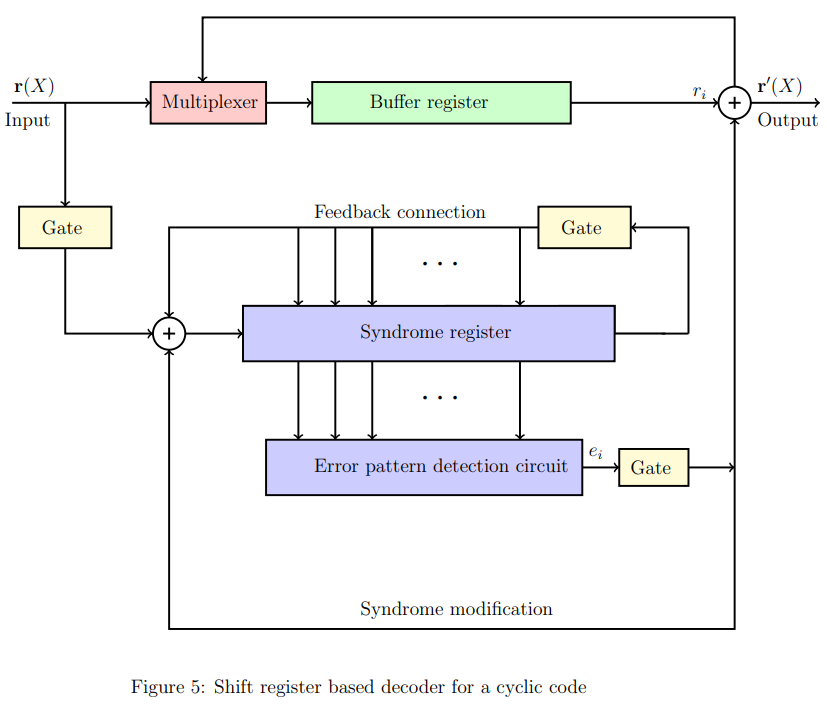

## Theory

The theory associated with Experiment-8 is divided into two parts:

(1) Basics of cyclic codes  
(2) Shift register based encoder and decoder

## 1 &nbsp; &nbsp; Basics of cyclic codes

Cyclic codes form an important subclass of linear block codes. In this section, we will introduce definition and basic properties of cyclic codes.   A detailed discussion of the topics covered in these notes can be found in [1, Chapter 5]. In this Experiment, we will focus on _binary_ cyclic codes. In Experiment-7, we had introduced Reed-Solomon codes. Note that Reed-Solomon codes form a class of _non-binary_ cyclic codes.   In Experiment-3, we studied Hamming codes, which are binary cyclic codes.   

Let us first define the operation of cyclic shift of a vector. Consider a vector $\mathbf{v} = [v_0,   v_1, v_{n-1}]$. 
Then the vector $\mathbf{v}^{(i)}$ obtained by shifting $\mathbf{v}$ cyclically to the right $i$-times is given by  
&nbsp; &nbsp; &nbsp; &nbsp; &nbsp; &nbsp; &nbsp; &nbsp; &nbsp; &nbsp;  &nbsp; &nbsp; &nbsp;&nbsp; &nbsp; $\mathbf{v}^{(i)} = [v_{n-i}  v_{n-i+1}  . . .  v_0   v_1  . . .  v_{n-i-1}]$. &ensp; &ensp;  &ensp; &ensp;&ensp; &ensp;&ensp; &ensp;&ensp;&ensp;&ensp;&ensp;&ensp;(1)  
For a cyclic code, as the name suggests,  cyclic shift of any codeword is also a codeword. This property precisely defines a cyclic code. 
 
 **Definition&ensp;1** &ensp; _A linear block code_ $C(n,k)$ _is said to be a cyclic code if every cyclic shift of a codeword is also a codeword in the given code_ $C(n,k)$.  
Before providing other properties of cyclic codes, let us consider a simple example for a cyclic code. Consider a linear block code of length $n=4$ and dimension $k=2$ 
with the set of codewords given by $\{ 0000, 1010, 0101, 1111 \}$. Observe that any cyclic shift of a codeword is again a valid codeword and hence this linear block code is a cyclic code. Students are encouraged to revisit Experiment-3 and verify that Hamming codes indeed follow this property and are cyclic codes.

For cyclic codes, it is convenient to represent its codewords using polynomials. The polynomial representation of vector $\mathbf{v} = [v_0  v_1  v_{n-1} ]$, denoted by $\mathbf{v}(X)$, is given by    
&ensp;&ensp;&ensp;&ensp;&ensp;&ensp;&ensp;&ensp;&ensp;&ensp;&ensp;&ensp;&ensp; $\mathbf{v}(X) = [ v_0 + v_1X + v_2X^2 + ... + v_{n-1}X^{n-1}]$. &ensp;&ensp;&ensp;&ensp;&ensp;&ensp;(2)

Let $\mathbb{F}_2[X]$ denotes the set of polynomials with the coefficients chosen from $\mathbb{F}_2$. Thus the polynomial $\mathbf{v}(X)$ in $\mathbb{F}_2[X]$.
For the given cyclic code $\mathcal{C}(n,k)$, there exists a polynomial $g(X)$ in $\mathbb{F}_2[X]$ such that any codeword $\mathbf{v}(X)$ in $\mathcal{C}(n,k)$ can be written as  
&ensp;&ensp;&ensp;&ensp;&ensp;&ensp;&ensp;&ensp;&ensp;&ensp;&ensp;&ensp;&ensp; $\mathbf{v}(X)$ $=$ $\mathbf{u}(X)g(X)$, &ensp;&ensp;&ensp;&ensp;&ensp;&ensp;&ensp;&ensp;&ensp;&ensp;&ensp;&ensp;&ensp;&ensp;&ensp;&ensp;&ensp;&ensp;&ensp;&ensp;&ensp;&ensp;&ensp;&ensp;&ensp;&ensp;&ensp;&ensp;(3)

where $\mathbf{u}(X)$ is the polynomial corresponding to the message $\mathbf{u} \in \mathbb{F}_2^k$. For multiplying two polynomials in $\mathbb{F}_2[X]$, the individual additions and multiplications of the corresponding coefficients should be performed over $\mathbb{F}_2$ (details can be found in the theory of Experiment-1, Part-1).
  See Eq.(5) discussed below for an illustration of multiplication of two polynomials in $\mathbb{F}_2[X]$. Observe that the maximum degree of a codeword polynomial will be $n-1$ and similarly the maximum degree of a message polynomial can be $k-1$.

The polynomial $g(X)$ defined in Eq.(3) is called as the _generating polynomial_ of the code and the corresponding cyclic code is said to be generated by its generating polynomial $g(X)$. 
We now summarize some of the properties of the generating polynomial. Details can be found in [1, Section 5.1]. The proofs of these properties are out of scope for our current experiment, however students are encouraged to verify these properties for Examples-1 and 2 given below.

 1. For the given cyclic code $\mathcal{C}(n,k)$, the generating polynomial $g(X)$ is the non-zero codeword of the minimum degree.  
 2. The generating polynomial of a cyclic code is unique.
 3. Degree of the generating polynomial is equal to $n-k$.
 4. Suppose $g(X)$ $=$ $g_0 + g_1X + ... + g_{n-k}X^{n-k}$. Then we have $g_0 = g_{n-k} = 1$.
 5. A generator matrix $G \in \mathbb{F}_2^{k \times n}$ of the code $\mathcal{C}(n,k)$ can be written directly using its generating polynomial $g(X) = g_0 + g_1X + ... + g_{n-k}X^{n-k}$ as follows,
  
 
 &ensp;&ensp;&ensp;&ensp; 
 
  
 6. The generating polynomial $g(X)$ is a factor of the polynomial $X^n+1$.
  
 Let us consider some examples of cyclic codes. 
 
<a/>
[//]: # 
1. **Example-1:** Consider the cyclic code of length $n=4$ and dimension $k=2$  with the set of codewords given by $\{ 0000, 1010, 0101, 1111 \}$. Suppose 
$\mathbf{v}_1 = 0000$, $\mathbf{v}_2 = 1010$, $\mathbf{v}_3 = 0101$, $\mathbf{v}_4 = 1111$. 

 &ensp;&ensp;&ensp; The polynomial representations of these codewords are given below
 

 

 &ensp;&ensp;&ensp; Observe that every codeword is a multiple of the polynomial ${1+X^2}$ and hence it is the generating polynomial of the code. Using property-5, can you write down a generating matrix of this code?

2. **Example-2:** Consider a cyclic code of length $n=7$ generated by the generating polynomial $g(X) = 1 +X +X^3$. Note that this is Hamming code of length $7$ studied in Experiment-3. 

 &ensp;&ensp;&ensp; A codeword $\mathbf{v}(X)$ in this code can be obtained by multiplying the message polynomial $\mathbf{u}(X)$ with the generating polynomial $g(X)$, i.e., $\mathbf{v}(X) = \mathbf{u}(X) g(X)$. For example, the codeword corresponding to the message polynomial $1+X$ is given by 
 

 
It can be seen from Eq.(5) that the codeword corresponding to message vector $\begin{bmatrix} 1 & 1 & 0 & 0\end{bmatrix}$ will be $\begin{bmatrix} 1 & 0 & 1 & 1 & 1 & 0 & 0\end{bmatrix}$.
All possible codewords of this code can be obtained by considering the message polynomials corresponding to all possible vectors in $\mathbf{F}_2^k$.

These are tabulated below. Students are encouraged to verify the calculations towards this by themselves.

## 2 &nbsp; &nbsp; Shift register based encoder and decoder
 
For encoding a message $\mathbf{u}$ in $\mathbf{F_2^k}$ using a cyclic code, one can consider a generator matrix $G$ of the given code and obtain the corresponding codeword as $\mathbf{v} = \mathbf{u}G$, since cyclic code is a linear block code. However, cyclic codes have rich algebraic structures and this allows to perform encoding operation much efficiently. Similarly, while one can perform decoding of cyclic codes via standard array and syndrome decoding (see Experiment-4), owing to these structural properties, decoding can be performed efficiently. In this experiment, we shall focus on shift register based encoder and decoder for cyclic codes. 
 
### 2.1 &nbsp; &nbsp; Shift register based encoder

Let us first study shift register based encoder for a cyclic code of length $n$ and the generator polynomial $g(X) = 1+X+X^2+\ldots+g_{n-k-1}X^{n-k-1}+X^{n-k}$ (recall that $g_0=g_{n-k}=1$). Suppose we wish to encode the message polynomial $\mathbf{u}(X) = u_0+u_1X+u_2X^2+ ... +u_{k-1}X^{k-1}$. Let $\mathbf{b}(X)$ be the remainder obtained when the polynomial $X^{n-k}\mathbf{u}(X)$ is divided by $g(X)$. Then it can be shown that (for proof refer [1, Section 5.1]) the corresponding codeword $\mathbf{v}(X)$ will be given by 
 
&ensp; &ensp;  &ensp; &ensp;&ensp; &ensp;&ensp; &ensp;&ensp;&ensp; $\mathbf{v}(X) = \mathbf{b}(X) + X^{n-k}\mathbf{u}(X).$ &ensp; &ensp;  &ensp; &ensp;&ensp; &ensp;(6)
 
We shall next see how Eq.(6) can be implemented using shift registers. The encoding circuit corresponding to this is shown in Figure~1. When the value of $g_i=1$, the corresponding connection will present, for $i = 2, 3, ... , n-k-1$. Similarly when $g_i=0$, the corresponding connection will not be there.  
Observe that there are $n-k$ shift registers. The contents of the shift registers are denoted by $b_0, b_1, ..., b_{n-k-1}$. Note that when the operation of the circuit is completed, the values of $b_0, b_1, ... , b_{n-k-1}$ will provide the coefficients of the required remainder polynomial $\mathbf{b}(X)$. 
 

 
$Figure 1: An encoder for the cyclic code of length $n$ and the generator polynomial g(X) = 1+X+X^2+ ... +g_{n-k-1}X^{n-k-1}+X^{n-k}$.
 
The encoding steps are summarized below.
1. The contents of all shift registers are initialized to zero.
2. Turn on the gate.
3. At $i$-th time instant, message bit $u_{k-i}$ is available at the input. Note that the message bit $u_{k-1}$ enters the system first, followed by $u_{k-2}$, and so on.
4. First perform all the computations (at the outputs of all XOR gates) using the present values of the shift registers and the input message bit $u_{k-i}$. This will provide the values of the shift registers for the next time instant.
5. Steps 3 and 4 should be performed for $i = 1, 2, ... , k$ time instances. 
6. Turn off the gate after $k$ time instances, i.e., when the computations corresponding to all message bits are completed.
7. The contents of the shift registers will now provide the coefficients of the remainder polynomial $\mathbf{b}(X)$.
8. To obtain the final codeword, the switch is kept at the message bits for the initial $k$ time instances and on the parity bits for the remaining $n-k$ time instances. Thus the final codeword is will be  
&ensp; &ensp;&ensp; &ensp;&ensp; &ensp; $\mathbf{v} = \begin{bmatrix} b_0 & b_1 & b_2 & u_0 & u_1 & u_2 & u_3 \end{bmatrix}$ &ensp; &ensp;&ensp; &ensp;&ensp; &ensp; 
 
**Encoder for Example-2:** Let us consider Example-2 to illustrate encoding steps. The encoder for Example-2 is shown in Figure-2. Suppose at some time instant, the contents of the shift register are $\begin{bmatrix} b_0 & b_1 & b_2 \end{bmatrix} = \begin{bmatrix} 0 & 1 & 1 \end{bmatrix}$ and the input message bit is $1$.
Then at the next time instant, contents of the shift registers will be $\begin{bmatrix} b_0 & b_1 & b_2 \end{bmatrix} = \begin{bmatrix} 0 & 0 & 1 \end{bmatrix}$.

 
$Figure 2: An encoder for the cyclic code of length $n=3$ and the generator polynomial g(X) = 1+X+X^3$.

